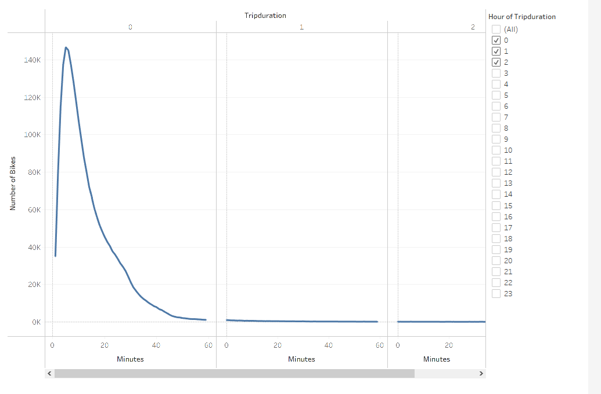
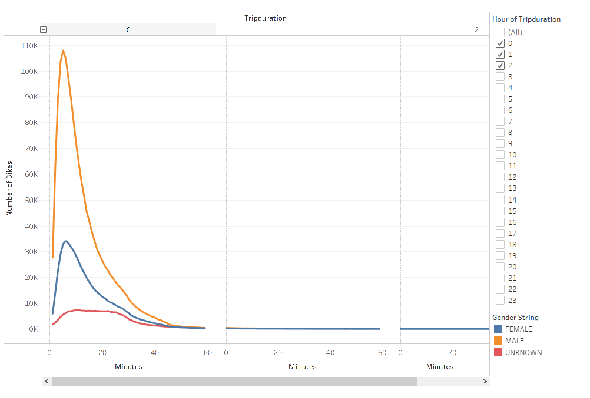
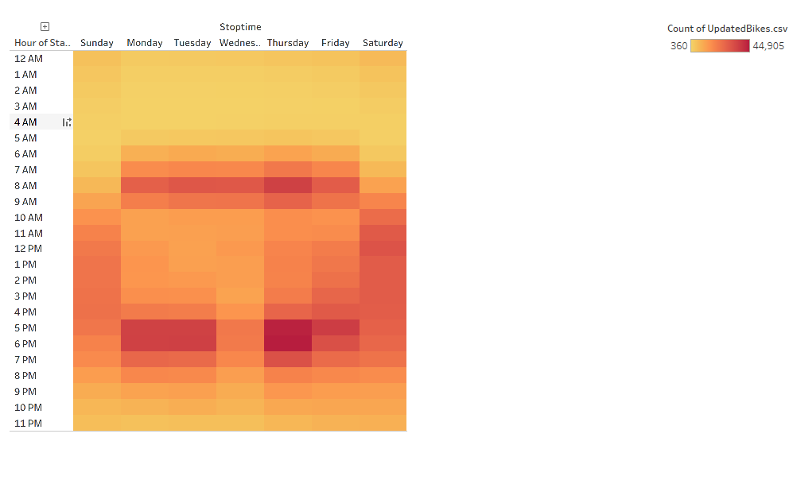
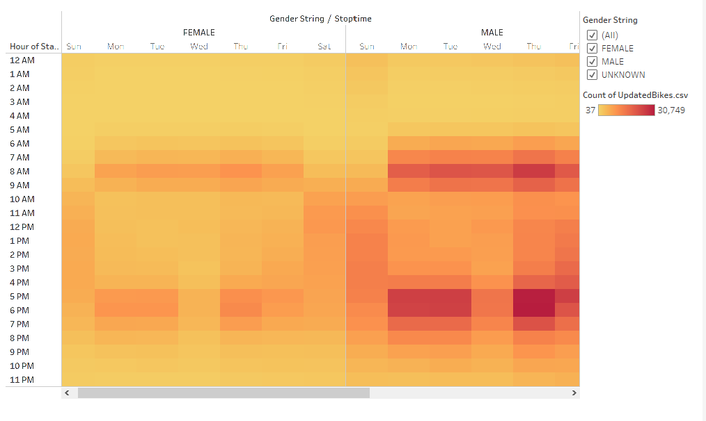
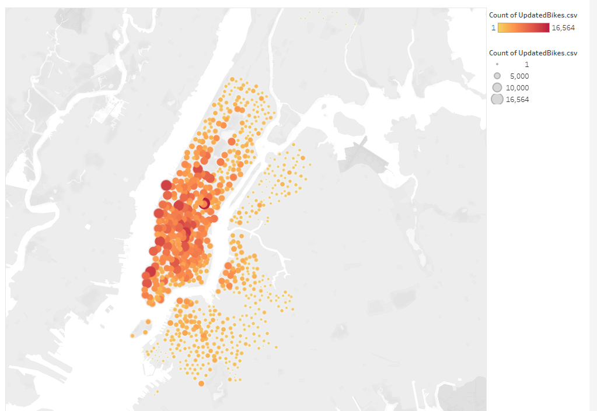
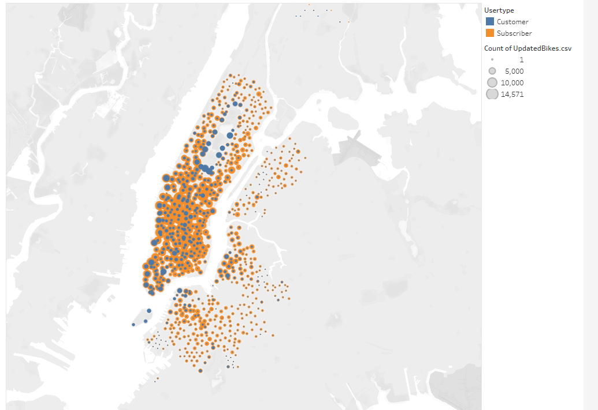

# Bikesharing

## Overview/Purpose

In this project, I am looking into starting a bike sharing business for Des Moines, Iowa.  I will need to create a presentation that gives information about what may or may not be effective in Des Moines.  Using Tableau, and data from a similar program in New York City, I was able to create visualizations to give investors an idea of how the business may work. 

## Results

The following visualizations were created to show the city how and when riders were using the bike sharing service.

### Checkout Times for Users

This graph shows the distribution of ride duration for the bike program.  The majority of the rides were not long.  The graph showed the the most common amount of time spent on the bike was 5 minutes.  This could be how long it took the rider to get to the desired destination.  It was rare the a rider stayed on the bike for more than an hour.  The second and third columns of the graph show the amount of riders spending over one and two hours on the bike. The line shows this did not happen very often.

### Checkout Times by Gender

This graph is very similar to the first graph, except it is specific to each gender.  This graph shows that males use the service much more often than females.  It also shows that people who do not put their gender into the app tend to spend a little more time on the bike.  A graph that compares the usertypes to the trip duration will show that the "Unknown" genders are more than likely the "Customers" usertype.  I would guess they did not take the time to put their genders into the app knowing they would not use it more than once.

### Trips by Weekday per Hour

This graph shows the most popular times in which the bike sharing service was used.  It is clear from the heatmap that the 7 am - 9 am and the 5 pm- 7 pm time slots have the most usage.  This could be because users bike to and from work.  If Des Moines was going to invest in the bike sharing service, they may need to be sure that the population of users lives close enough to successfully use the bikes.

### Trips by Gender (Weekday per Hour)

This graph also shows the most popular times for bike users.  It, however, also compares the gender usage.  There is very little difference in the gender usage compared with the time of day.  The "Unknown" genders (who are most likely the people who are visiting the town) use bikes more on the weekend than during the week.

### User Trips by Gender by Weekday

This heatmap showing the bike usage on each day of the week by genders and by usertypes confirms the suspicions from above.  The "Customers" use the service a bit more on the weekends.  It also shows that Thursdays tend to have the highest usage.

### Starting Locations

This heatmap shows the most popular starting destinations.  I would use it to determine where the majority of the bikes need to be placed.  The graph shows that there is a pocket of the city where biking is much more popular.

### Starting Locations by Usertype

This map is very similar to the map above except it breaks things down into usertype as well.  The blue dots represent the one time customers and the orange dots represent the subscribers.  There is an interesting rectangle of blue located in the northern part of the city.  I would guess this is an area that tourists often visit.  This is probably also an area where few subscribers tend to live.  If possible, more bikes need to be placed in this location on the weekends.

## Summary
In order for the bike sharing to work in the Des Moines area there are few things that I believe need to be in place:
- The population needs to live near enough to work that biking is a legitimate option.  The majority of users in NYC seem to bike to and from work, so for this business to work in Des Moines the same thing needs to happen.
- Most of the users in NYC are also subscribers.  To get this business rolling, getting people to sign up as a subscriber would be a priority.
- There is a population of customers that will enjoy the bikes while in town.  This tells me that we need to keep in mind that having the bikes near hotels and city attractions could elevate the business.

## Tableau Link
[https://public.tableau.com/app/profile/bryan.gurss/viz/Module-14-Challenge_16275167565530/CitiBikeAnalysisStory?publish=yes]

